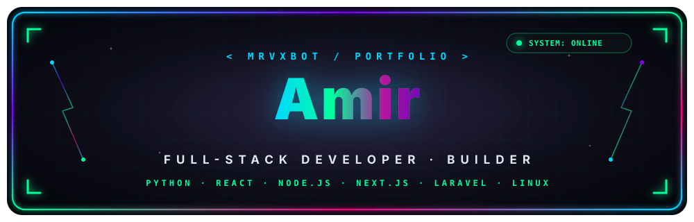

<a id="top"></a>

<!-- Signature Cyber Hero Banner -->
<p align="center">
  
</p>

<!-- Animated Typing Subtitle -->
<p align="center">
  <a href="https://git.io/typing-svg">
    
  </a>
</p>

<!-- Dynamic Status & Stats Bar -->
<p align="center">
  
  
  
  
</p>

<br/>

<!-- Section: Neofetch Terminal Showcase -->
## 🖥️ $ neofetch

```text
mrvxbot@github:~$ neofetch
   ╭─────────────╮      mrvxbot@github
   │             │      ─────────────────────────────────
   │   G I T     │      Name:       Amir
   │   H U B     │      Role:       Full-Stack Developer · Builder
   │             │      Stars:      7
   ╰─────────────╯      Repos:      13
   ╭─────────────╮      Followers:  3
   │    bot_     │      Top Lang:   Python
   ╰─────────────╯      OS:         Linux (Debian/Ubuntu)
                        Shell:      bash 5.2.15
                        Focus:      Automation, Web Apps & CLI Tools
                        Note:       ❌ No C++ / No Java
                        Uptime:     always building...
```

<br/>

## ⚡ $ whoami

- 🔭 **Current Focus:** Building high-performance full-stack web applications & automation tools.
- ⚡ **Tech Stack:** Python, React, Next.js, Node.js, Laravel/PHP, Linux, Bash, Git.
- 🎯 **Engineering Principles:** Clean Architecture, Modular Code, Scalability & Automation.
- 🚫 **Rule:** I explicitly do not work with C++ or Java.

<details>
<summary><b>🔍 Click to view detailed technical stack & system architecture</b></summary>

<br/>

| Domain | Technologies & Infrastructure |
| :--- | :--- |
| **Frontend Engineering** | React.js, Next.js (SSR / SSG / ISR), HTML5, CSS3, JavaScript (ES6+), Tailwind CSS |
| **Backend & APIs** | Node.js (Express), Laravel (PHP), RESTful APIs, Auth Middleware, Clean Architecture |
| **Automation & Scripting** | Python (CLI tools, Web Automation, Telegram Bots, Scrapers), Bash Scripts |
| **DevOps & Linux OS** | Linux Administration, Bash Shell, SSH Management, Nginx, Server Deployments |
| **Version Control** | Git Workflows, GitHub Actions, Feature Branching, CI/CD |

</details>

<br/>

## 📊 $ cat skill_proficiency.matrix

```text
Python             ████████████████████░░  90%  - CLI Tools, Automation, Telegram Bots
React / Next.js    █████████████████░░░░░  85%  - SPA, SSR, Modern Web Apps
Node.js / Express  ████████████████░░░░░░  80%  - REST APIs, Middleware, Microservices
Laravel / PHP      ███████████████░░░░░░░  75%  - MVC Architecture, Web Portals
Linux / Bash       ██████████████████░░░░  88%  - Shell Scripting, Server Admin, SSH
Git & DevOps       █████████████████░░░░░  85%  - CI/CD, Actions, Repository Workflows
```

<br/>

## 🛠️ $ ls -la skills/

<p align="center">
  <a href="https://skillicons.dev">
    
  </a>
</p>

<p align="center">
  
  
  
  
  
  
  
  
  
  
</p>

<br/>

## 🚀 $ cat featured_projects.md

<p align="center">
  <a href="https://github.com/mrVXBoT/mrVXBoT">
    
  </a>
  <a href="https://github.com/mrVXBoT/github-profilinator">
    
  </a>
</p>

<br/>

<!-- Section: Analytics & Metrics Dashboard -->
## 📊 $ ./stats.sh

<p align="center">
  
  
</p>

<br/>

<!-- Section: REAL LIVE GITHUB CONTRIBUTION HEATMAP (DIRECTLY CONNECTED TO mrVXBoT COMMITS) -->
## 📈 $ ./contributions.sh

<p align="center">
  
</p>

<br/>

<p align="center">
  
</p>

<br/>

## 💬 $ fortune | cowsay

<p align="center">
  
</p>

<br/>

## 🤝 $ connect --now

> *"Code is like humor. When you have to explain it, it’s bad."* – Cory House

<br/>

<p align="center">
  <a href="https://github.com/mrVXBoT" target="_blank">
    
  </a>
  &nbsp;&nbsp;
  <a href="https://instagram.com/VX_00i" target="_blank">
    
  </a>
  &nbsp;&nbsp;
  <a href="mailto:mrvxbot@gmail.com" target="_blank">
    
  </a>
</p>

<br/>

<p align="center">
  <a href="#top">
    
  </a>
</p>

<p align="center">
  
</p>
